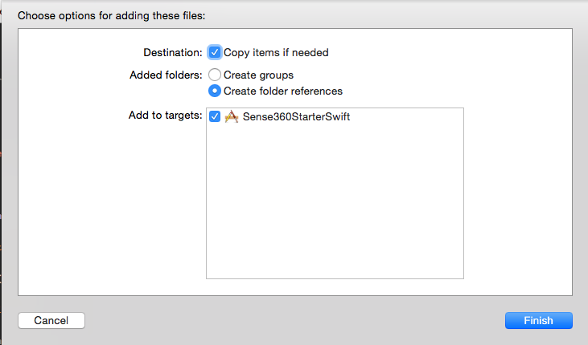
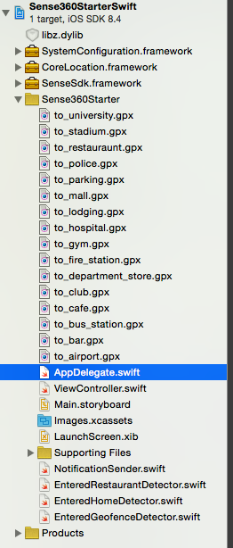
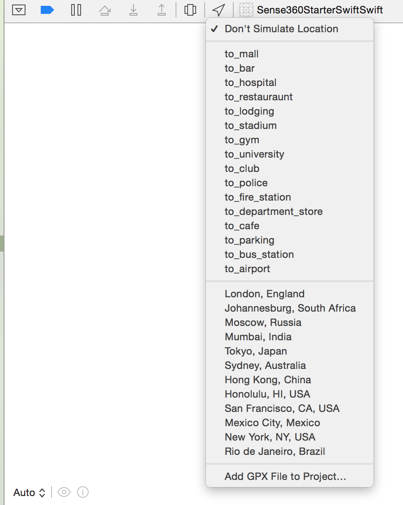

# Introduction

Sense360 allows you to quickly build functions around actions that your users take in the physical world. You can build triggers based on where a user is, what they are doing, or what is happening around them. **You can do all this in the background, even if your app is closed.** Adding these real-world triggers to your app can take months if you try to achieve high accuracy, low battery drain, and maximum user privacy. We make the process quick and painless.

Eventually, we aim to have a trigger for any action a user can take, whether it be "running", "driving", "waking up", "eating", "watching tv", "playing basketball", "watching basketball", etc.

**Sign up for a developer key** by clicking the "Request API Key" on the top right

Have fun creating!

# Requirements

- Must be using Xcode 7.0.
- Deployment target must be iOS 8.0.

# Template Project

A Swift starter project can be found at: <a href='https://github.com/Sense360/Sense360StarterSwift' onclick= "clickedDownloadGithubProjectSwift()">https://github.com/Sense360/Sense360StarterSwift</a>

The same project but for objective-c can be found at: <a href='https://github.com/Sense360/Sense360StarterObjC' onclick= "clickedDownloadGithubProjectObjC()">https://github.com/Sense360/Sense360StarterObjC</a>

# Download

## Latest
You can download the latest framework <a href='https://s3-us-west-1.amazonaws.com/sense360-public-files/sdk/SenseSdk.framework-latest.zip' onclick= "clickedDownloadLibraryLink()">here</a> (Version 2.1). 

Upgrading from Version 1.x to Version 2.x requires some code migration, our guide can be found <a href='migration_guide.html'>here</a>.

Release Notes can be found [here](#version-2.1).

### Previous
- <a href='https://s3-us-west-1.amazonaws.com/sense360-public-files/sdk/SenseSdk.framework-2.0.zip'>Download Version 2.0</a>
- <a href='https://s3-us-west-1.amazonaws.com/sense360-public-files/sdk/SenseSdk.framework-1.2.zip'>Download Version 1.2</a>
- <a href='https://s3-us-west-1.amazonaws.com/sense360-public-files/sdk/SenseSdk.framework-1.1.zip'>Download Version 1.1</a>

# Quick Start

To get up running quickly we also have provided a <a href="http://www.sense360.com/getting_started.html">Quick Start Guide</a>.

We also have a code generator to help with your specific case <a href="http://www.sense360.com/code_generator.html">Code Generator</a>.

# API Concepts

The following are the main components of building with Sense360

[Trigger](#triggers): The real-world event that you want to listen for (can be a place, action, or contextual element). Example triggers are “has arrived at airport”, “has exited work”, or “is 100 miles from home”

[Delegate](#delegate): The method that is called when the trigger is fired.  This is where you, the developer, can act when the trigger fires.


# Triggers

Triggers define the conditions under which your app should be notified.  There are 3 categories of places that you can be notified about.  These categories are:

- [Place of Interest](#place-of-interest) - Examples are: Restaurant, Shopping Mall, etc.
- [Personal Place](#personal-place) - Examples are: Home, Work.
- [Custom Geofence](#custom-geofence) - These can be any latitude/longitude point with a radius.

All triggers are built by the class FireTrigger.  Within there, you will find every function you need to get going.

## Place of Interest

Gives you the ability to be notified when a user enters or exits a particular POI type.

```swift
// Will notify you when the user enters an Airport
let restaurantTrigger = FireTrigger.whenEntersPoi("ArrivedAtRestaurant", type:.Restaurant)
```

```objective_c
// Will notify you when the user enters an Airport
Trigger *restaurantTrigger = [FireTrigger whenEntersPoi:@"ArriveAtRestaurtant" type:PoiTypeRestaurant conditions:nil errorPtr:nil];
```

It is also possible to fire a trigger when a user enters or exits any of the POI categories specified below.  If you wish to do this, use the "PoiType.All" category.

```swift
// Will notify you when the user enters any category Sense360 supports
let allPoiTypesTrigger = FireTrigger.whenEntersPoi("ArrivedAtPoi", type: .All)
```

```objective_c
// Will notify you when the user enters any category Sense360 supports
Trigger *allPoiTypesTrigger = [FireTrigger whenEntersPoi:@"ArrivedAtPoi" type:PoiTypeAll conditions:nil errorPtr:nil];
```

Supported POI types:

Category | Transitions | |
--------- | ------- |------- |
Airport | .whenEntersPoi("TriggerName", type:.Airport) | .whenExitsPoi("TriggerName", type:.Airport)
Bar | .whenEntersPoi("TriggerName", type:.Bar) | .whenExitsPoi("TriggerName", type:.Bar)
BusStation | .whenEntersPoi("TriggerName", type:.BusStation) | .whenExitsPoi("TriggerName", type:.BusStation)
Cafe | .whenEntersPoi("TriggerName", type:.Cafe) | .whenExitsPoi("TriggerName", type:.Cafe)
DepartmentStore | .whenEntersPoi("TriggerName", type:.DepartmentStore) | .whenExitsPoi("TriggerName", type:.DepartmentStore)
FireStation | .whenEntersPoi("TriggerName", type:.FireStation) | .whenExitsPoi("TriggerName", type:.FireStation)
Gym | .whenEntersPoi("TriggerName", type:.Gym) | .whenExitsPoi("TriggerName", type:.Gym)
Hospital | .whenEntersPoi("TriggerName", type:.Hospital) | .whenExitsPoi("TriggerName", type:.Hospital)
Lodging | .whenEntersPoi("TriggerName", type:.Lodging) | .whenExitsPoi("TriggerName", type:.Lodging)
Mall | .whenEntersPoi("TriggerName", type:.Mall) | .whenExitsPoi("TriggerName", type:.Mall)
MovieTheater | .whenEntersPoi("TriggerName", type:.MovieTheater) | .whenExitsPoi("TriggerName", type:.MovieTheater)
NightClub | .whenEntersPoi("TriggerName", type:.NightClub) | .whenExitsPoi("TriggerName", type:.NightClub)
Parking | .whenEntersPoi("TriggerName", type:.Parking) | .whenExitsPoi("TriggerName", type:.Parking)
PoliceDepartment | .whenEntersPoi("TriggerName", type:.PoliceDepartment) | .whenExitsPoi("TriggerName", type:.PoliceDepartment)
Restaurant | .whenEntersPoi("TriggerName", type:.Restaurant) | .whenExitsPoi("TriggerName", type:.Restaurant)
Supermarket | .whenEntersPoi("TriggerName", type:.Supermarket) | .whenExitsPoi("TriggerName", type:.Supermarket)
Stadium | .whenEntersPoi("TriggerName", type:.Stadium) | .whenExitsPoi("TriggerName", type:.Stadium)
University | .whenEntersPoi("TriggerName", type:.University) | .whenExitsPoi("TriggerName", type:.University)


### Caveats
- Besides the "All" category, each trigger can only detect a single POI type.

## Personal Place

Gives you the ability to be notified when a user enters or exits their home or work. You can also be notified if the user is far awar from their home or work.

```swift
// Will notify you when the user enters their Home
let homeTrigger: Trigger? = FireTrigger.whenEntersPersonalizedPlace("ArrivedAtHome", type:.Home)
```

```objective_c
// Will notify you when the user enters their Home
Trigger *homeTrigger = [FireTrigger whenEntersPersonalizedPlace:@"ArrivedAtHome" type:PersonalizedPlaceTypeHome conditions:nil errorPtr:nil];
```


The currently supported personalized location categories are:

Category | Transitions | |
--------- | ------- |------- |
Home | .whenEntersPersonalizedPlace("TriggerName", type:.Home) | .whenExitsPersonalizedPlace("TriggerName", type:.Home)
Work | .whenEntersPersonalizedPlace("TriggerName", type:.Work) | .whenExitsPersonalizedPlace("TriggerName", type:.Work)

### Caveats
- The SDK takes roughly a week to determine a user's home or work. After the SDK identifies the users home or work, it can then start detecting the users presence there.
- The SDK will continually try to update the user's home every few days.
- The SDK will not trigger immediately on entrance or exit because it needs to be sure of the user's presence.

<aside class="warning">Due to the sensitivity of this data, neither developers nor Sense360 will ever see the raw data or store a users home or office location. The computation happens on the device itself and stays there to ensure your user's privacy.</aside>

## Custom Geofence

A custom geofence allows you specify a region to monitor for entrance and exit. This geofence will only be registered for this user (not your entire application).

```swift
let hq = CustomGeofence(latitude: 37.124, longitude: -127.456, radius: 50, customIdentifier: "Sense 360 Headquarters")
let lunchSpot = CustomGeofence(latitude: 37.124, longitude: -127.456, radius: 50, customIdentifier: "A&B Bar and Grill")
let geofenceTrigger: Trigger? = FireTrigger.whenEntersGeofences("ArrivedAtGeofence", geofences:[hq, lunchSpot])
```

```objective_c
CustomGeofence *hq = [[CustomGeofence alloc] initWithLatitude:37.124 longitude:-127.456 radius:50 customIdentifier:@"Sense 360 Headquarters"];
CustomGeofence *lunchSpot = [[CustomGeofence alloc] initWithLatitude:37.124 longitude:-127.456 radius:50 customIdentifier:@"A&B Bar and Grill"];
NSArray *geofences = [[NSArray alloc] initWithObjects:hq,lunchSpot,nil];
[FireTrigger whenEntersGeofences:@"ArrivedAtGeofence" geofences:geofences conditions:nil errorPtr:nil];
```

All custom geofence triggers must specify the following parameters

Parameter | Type | Required | Description
--------- | ------- |------- | -----------
location | Location | true | location
radius | Int | true | radius of geofence
customIdentifier | String | true | unique identifier for your geofence

Type | Transitions | |
--------- | ------- |------- |
CustomGeofence | .whenEntersGeofences() | .whenExitsGeofences()

### Caveats

- You can specify at most 1000 geofences to monitor
- Geofences must have a radius of at least 30m
- The SDK will not trigger immediately on entrance or exit because it needs to be sure of the user's presence.

## Conditional Elements

A conditional element is an extra restriction that you can create for a trigger that must be satisfied. A condition must be paired with a trigger and cannot stand alone.

Several conditions may be applied when creating any type of trigger through the FireTrigger class.  All conditions applied to a trigger MUST be satisfied in order for the entire trigger to fire.


### Time Window

A time window specifies which hours of the day a trigger is allowed to fire.

```swift
// This will only allow a trigger to fire between the hours of
// 5pm and 10pm (in the users local time)
let timeWindow = TimeWindow.create(fromHour: 17, toHour: 22)
let restaurantTrigger = FireTrigger.whenEntersPoi("ArrivedAtRestaurant", type: .Restaurant, conditions: [timeWindow])
```

```objective_c
// This will only allow a trigger to fire between the hours of
// 5pm and 10pm (in the users local time)
TimeWindow *timeWindow = [TimeWindow createFromHour:17 toHour:22 errorPtr:nil];
NSArray* conditions = [[NSArray alloc] initWithObjects:timeWindow, nil];
Trigger *restaurantTrigger = [FireTrigger whenEntersPoi:@"ArrivedAtRestaurant" type:PoiTypeRestaurant conditions:conditions errorPtr:nil];
```

#### Params
Parameter | Type | Range | Required | Description
--------- | ------- |------- | ----------- | -----------
fromHour | Int | 0-23 | true | Window start time (user's local time)
toHour | Int | 0-23 | true | Window end time (user's local time)


#### Caveats

- The transition must occur between the times specified. For example, if a user enters at 5am, and the window was set for 6am - 7am, the trigger WILL NOT fire, even if the user is still within the specified geofence at 6am.

### Cooldown

The amount of time after a trigger fires, to wait before the same trigger can fire again.

```swift
// Wait 2 days after the trigger fires before allowing it to fire again
let cooldown = Cooldown.create(oncePer: 2, frequency: .Days)!
let restaurantTrigger = FireTrigger.whenEntersPoi("ArrivedAtRestaurant", type: .Restaurant, conditions: [cooldown])
```

```objective_c
// Wait 2 days after the trigger fires before allowing it to fire again
Cooldown* cooldown = [Cooldown createWithOncePer:2 frequency:CooldownTimeUnitDays errorPtr:nil];
NSArray* conditions = [[NSArray alloc] initWithObjects:cooldown, nil];
Trigger *restaurantTrigger = [FireTrigger whenEntersPoi:@"ArrivedAtRestaurant" type:PoiTypeRestaurant conditions:conditions errorPtr:nil];
```

#### Values

Unit | Signature 
--------- | ------- |
Minutes|Cooldown.create(oncePer: 5, frequency: .Minutes)!
Hours|Cooldown.create(oncePer: 5, frequency: .Hours)!
Days|Cooldown.create(oncePer: 5, frequency: .Days)!
Default | Cooldown.create(oncePer: 30, frequency: .Minutes)!

#### Caveats
- The minimum cooldown time is 5 minutes.


###Activity Condition

Activity conditions are used to check the mode of transportation in which a user either arrives or departs from a specified place.

For example, if you want to be notified when a user enters a restaurant, BUT only when they arrived by car, you would do the following:

```swift
let arrivedByCar = UsersActivity.arrivedBy(.Automotive)!
let restaurantTrigger = FireTrigger.whenEntersPoi("ArrivedAtRestaurant", type: .Restaurant, conditions: [arrivedByCar])
```

```objective_c
ConditionalElement* arrivedByCar = [UsersActivity arrivedBy:ActivityTypeAutomotive errorPtr:nil];
NSArray* conditions = [[NSArray alloc] initWithObjects:arrivedByCar, nil];
Trigger *restaurantTrigger = [FireTrigger whenEntersPoi:@"ArrivedAtRestaurant" type:PoiTypeRestaurant conditions:conditions errorPtr:nil];
```


There are 4 types of activities available:

 |
--------- |
walking |
running |
automotive |
cycling |

### Farther Than Condition

The farther than condition ensures that the trigger will only fire if the user is farther than X kilometers from either a personalized place or a list of custom geofences.

For example, you can trigger when a user enters a restaurant that is farther than 150 kilometers from their home.

```swift
let fartherThanHome = UsersLocation.isFartherThanPersonalizedPlace(.Home, kilometers: 150)!
let restaurantTrigger = FireTrigger.whenEntersPoi("ArrivedAtRestaurant", type: .Restaurant, conditions: [fartherThanHome])
```
```objective_c
ConditionalElement *fartherThanHome = [UsersLocation
                                       isFartherThanPersonalizedPlace:PersonalizedPlaceTypeHome
                                       kilometers:[NSNumber numberWithInt:150]
                                       errorPtr:nil];
NSArray* conditions = [[NSArray alloc] initWithObjects:fartherThanHome, nil];
Trigger *restaurantTrigger = [FireTrigger whenEntersPoi:@"ArrivedAtRestaurant" type:PoiTypeRestaurant conditions:conditions errorPtr:nil];
```

Category | Transitions |
--------- | ------- |
Home |  whenExitsPersonalizedPlace(.Work, kilometers: 10)
Work | whenExitsPersonalizedPlace(.Work, kilometers: 10)
CustomGeofence | .whenExitsGeofences([CustomGeofence], kilometers: 10)

#### Caveats:

- If you specify multiple geofences within a single condition, the user must be farther than ALL of the locations in order to trigger the callback.
- If you need to create a fartherThan condition where user only needs to be [x] distance from one of multiple locations, you will need to create an individual Trigger PLUS Conditional Element per geofence.

<aside class="warning"> Note: you cannot use the fartherThan condition with POI Place Types.
</aside>

## Handling Trigger Creation Errors

When creating triggers an error can be returned instead of a trigger if an invalid trigger has been created.

```swift
let errorPointer = SenseSdkErrorPointer.create()
let trigger = FireTrigger.whenEntersPoi("ArrivedAtAirport", type: .Airport, errorPtr: errorPointer)
if let airportTrigger = trigger {
    NSLog("Success monitoring airport entrance!")
} else {
    NSLog("Error building airport trigger. Msg=" + errorPointer.error!.message)
}
```

```objective_c
SenseSdkErrorPointer *errorPtr = [SenseSdkErrorPointer create];
Trigger *restaurantTrigger = [FireTrigger whenEntersPoi:@"ArrivedAtRestaurant" type:PoiTypeRestaurant conditions:nil errorPtr:errorPtr];
if(restaurantTrigger != nil) {
    NSLog(@"Success monitoring airport entrance!");
} else {
    NSLog(@"%@", errorPtr.error.message);
}
```

In the event that there is an error when setting up a trigger, a nil will be returned with the error message stored within the corresponding SenseSdkErrorPointer.


# Delegate

The delegate is where you defined what YOUR app will do upon a trigger firing.  For example, if you want to send a message whenever a user enters a restaurtant, the delegate is where you write the code that would send the text message.

In order to setup a delegate, you need to create a class that implements the TriggerFiredDelegate protocol.  In the example below, we will be logging all places received by the trigger once it fires:

```swift
class MyCallback : TriggerFiredDelegate {
    @objc func triggerFired(args: TriggerFiredArgs) {
        for place in args.places {
            //This is where YOU would write your custom code.
            //As an example, I am logging the description of the place the user has arrived
            NSLog(place.description)
        }
    }
}
```

```objective_c
@interface MyCallback : NSObject<TriggerFiredDelegate>
@end

@implementation MyCallback {
    - (void)triggerFired:(TriggerFiredArgs*) args {
        for (NSObject <NSCoding, Place>* place in [args places]) {
            //This is where YOU would write your custom code.
            //As an example, I am logging the description of the place the user has arrived
            NSLog(@"%@", [place description]);
        }
    }
}
@end
```

<aside class="warning"> In the event that your app was not running previously, your code will have 10 seconds to run once we call your trigger delegate method.
After which time, iOS is free to shutdown your app.
</aside>


There are 3 important classes that contain the information on where and when your trigger fired:

## TriggerFiredArgs

The details of a trigger when it fires.

Property | Type | Description
--------- | ------- |-------
places | [[Place](#places)] | An array of places that matches your trigger (Currently, this will only return a single value)
timestamp | NSDate | The time at which this trigger fired

## Types of places

Below is a list of the types of places that can be passed back when the trigger fires. Which one is presented depends on the type of trigger you use.

### CustomGeofence

Property | Type | Description
--------- | ------- |-------
customIdentifier | String | A unique string which identifies the custom geofence (provided by you)
location | Location | The latitude and longitude of the geofence center point
radius | Double | The radius of the geofence

### PoiPlace

Property | Type | Description
--------- | ------- |-------
location | Location | The latitude and longitude of the poi's center point
types | [[PoiType](#poitype)] | A list of categories for this place


#### PoiType

 |
--------- |
Airport |
Bar |
Restaurant |
Mall |
Cafe |
Gym |
Loding |
PoliceDepartment |
BusStation |
DepartmentStore |
FireStation |
Stadium |
Hospital |
Parking |
NightClub |
University |


### PersonalizedPlace
Property | Type | Description
--------- | ------- |-------
personalizedPlaceType | [PersonalizedPlaceType](#personalizedplacetype) | The type of place

#### PersonalizedPlaceType

 |
--------- |
Home |
Work |


## Working with different types of places

You may need to cast a place to the appropriate type once your trigger fires.  The following sample code shows you how to cast to any of the given types above depending on the place type:

```swift
@objc func triggerFired(args: TriggerFiredArgs) {

        NSLog("Trigger \(args.trigger.name) fired at \(args.timestamp). ")

        if args.places.count > 0 {
            let place = args.places[0]

            let transitionDesc = args.trigger.transitionType.description
            switch(place.type) {
                case .CustomGeofence:
                    if let geofence = place as? CustomGeofence {
                        NSLog("\(transitionDesc) \(geofence.customIdentifier)")
                    }
                    break;
                case .Personal:
                    if let personal = place as? PersonalizedPlace {
                        NSLog("\(transitionDesc) \(personal.personalizedPlaceType.description)")
                    }
                    break;
                case .Poi:
                    if let poi = place as? PoiPlace {
                        NSLog("\(transitionDesc) \(poi.types[0].description)")
                    }
                    break;
            }
        }
    }
```

```objective_c
- (void)triggerFired:(TriggerFiredArgs*) args {
    //Your user has entered a restaurant!//
    NSString *transitionDesc;
    if(args.trigger.transitionType == TransitionTypeEnter) {
        transitionDesc = @"Enter";
    } else {
        transitionDesc = @"Exit";
    }
    
    NSObject<NSCoding, Place> *place = (NSObject<NSCoding, Place>*)args.places[0];
    
    if(place.type == PlaceTypeCustomGeofence) {
        
        CustomGeofence *geofence = (CustomGeofence*)place;
        NSString *notificationBody = [[NSString alloc] initWithFormat: @"%@ %@", transitionDesc, geofence.customIdentifier];
        [NotificationSender send:notificationBody];
        
    } else if(place.type == PlaceTypePersonal) {
        
        PersonalizedPlace *personalizedPlace = (PersonalizedPlace*)place;
        NSString *personalizedPlaceType = [PersonalizedPlace getDescriptionOfPersonalizedPlaceType:(int)personalizedPlace.type];
        NSString *notificationBody = [[NSString alloc] initWithFormat: @"%@ %@", transitionDesc,personalizedPlaceType];
        [NotificationSender send:notificationBody];
        
    } else if(place.type == PlaceTypePoi) {
        
        PoiPlace *poiPlace = (PoiPlace*)place;
        NSString *notificationBody = [[NSString alloc] initWithFormat: @"%@ %@", transitionDesc, poiPlace.description];
        [NotificationSender send:notificationBody];
        
    }
}
```


# SenseSdk

The SenseSdk is the main entry point into the SDK. It allows you to register and unregister triggers.

<aside class="warning"> You must call enableSdkWithKey in your AppDelegate's applicationDidFinishLaunching method.
</aside>

```swift
// Registering a trigger and delegate
let success = SenseSdk.register(trigger: restaurantTrigger, delegate: self, errorPtr: nil)
```

```objective_c
// Registering a trigger and delegate
Boolean success = [SenseSdk registerWithTrigger:restaurantTrigger delegate:callback errorPtr:nil];
```

Function | Parameters | Description
--------- | ------- |------- 
enableSdkWithKey | String | Enable the SDK with your application key (provided by Sense360)
register | [Trigger](#triggers), [TriggerFiredDelegate](#handling-trigger-firing), [SenseSdkErrorPointer](#sensesdkerrorpointer) | Starts the trigger and registers the delegate to be called when the trigger fires.
findTrigger | String | Finds and returns a trigger by name.
unregister | String | Stops and removes the trigger from the SenseSdk by name.
unregisterAll | | Stops and removes ALL triggers from the SenseSdk.

<aside class="notice"> Your application key will be validated regulary every few days.
</aside>

## SenseSdkErrorPointer

This class is used to communicate any errors on a registration of a trigger with the [SenseSdk](#sensesdk).

Containing Class | Property | Description
--------- | ------- |------- | ---------
SenseSdkError | message | The error message

# Testing

## Simulating Location

Included with the SDK (and both starter projects) are sample GPX routes that will allow you to fire triggers for each POI type. These simulate real world conditions and will take time to fire your triggers. While building, you should use the SenseSdkTestUtilitiy (see [Unit Testing](#unit-testing) section below). These should be use to minimize your time testing in the real world.

<aside class="warning">These location simulations will only work on a real iPhone device. They will NOT work on the simulator.
</aside>

<aside class="warning">Since you are simulating real-world behavior, triggers can take 5 - 20 minutes to fire during simulated testing.
</aside>

1. Drag the file(s) you wish to test with into your Xcode project or click Debug -> Simulate Location -> Add GPX File to Project
  
  
2. Make sure that at least one trigger is being registered (very important!)
3. Turn your app on
4. Simulate location (using the arrow, or Debug -> Simulate Location -> GPX File) and wait for a notification!
  
5. Make sure to turn off simulating a location when you are finished by going to the location menu and selecting "Don't simulate location". If you don't turn off location simulation, your phone will continue to simulate location until you restart your device.

## Debug Notifications

If you wish to verify that your triggers are being registered properly, you can enable Debug Notifications with the SDK:

1. Open your info.plist. (go to your project and hit the Info tab at the top of the screen)
2. Add the key "sense360:sendDebugNotifications"
3. Set it to a Boolean with a value of YES

You should get notifications every time we believe the phone has arrived at a place. At that point, our 2nd tier logic starts to figure out exactly where the device is (i.e. a POI type, home, work, etc).

## Unit Testing

While you are building your application, you should use this method of testing because testing in the real world is time consuming. The SenseSdkTestUtility will fire your trigger immediately if your trigger is registered properly. This method is helpful if you need to do quick iterations on your feature or if you want to verify your code works well.

The example below shows you how to fire a trigger called "ArrivedAtRestaurant" with a restaurant called "Big Foot's Burgers".

```swift
//Create your fake restaurant
let place = PoiPlace(latitude: 34.111, longitude: -118.111, radius: 50,
    name: "Big Foot's Burgers", id: "id1", types: [.Restaurant])

let errorPointer = SenseSdkErrorPointer.create()
// This method should only be used for testing
SenseSdkTestUtility.fireTrigger(
    "ArrivedAtRestaurant",
    confidenceLevel: ConfidenceLevel.Medium,
    places: [place],
    errorPtr: errorPointer
)

if errorPointer.error != nil {
    NSLog("Error sending trigger")
}
```

```objective_c
//Create a fake restaurant
PoiPlace* poiPlace = [[PoiPlace alloc] initWithLatitude:34.111
                         longitude:-118.111
                            radius:50
                              name:@"Big Restaurant"
                                id:@"id1"
                              type: PoiTypeRestaurant];
SenseSdkErrorPointer* errorPtr = [SenseSdkErrorPointer create];

// This method should only be used for testing
NSArray* places = [[NSArray alloc] initWithObjects:poiPlace, nil];
[SenseSdkTestUtility fireTrigger:@"ArrivedAtRestaurant"
                           confidenceLevel:ConfidenceLevelMedium
                                    places:places
                                  errorPtr:errorPtr];
if(errorPtr.error != nil) {
    [NotificationSender send:@"Error sending trigger"];
}
```

You will have to create the correct type of place depending on the type of trigger.  For example, if you have you have the case of "Enter Home", then you must make a place of type PersonalizedPlace.  The list of place types with their corresponding types can be found under: [Places](#places)

The example code below will show you how to create a personalized place, and fire a trigger named "ArrivedAtHome".

```swift
// Create a fake home location
let place = PersonalizedPlace(latitude: 34.111, longitude: -118.111, 
  radius: 50, personalizedPlaceType: .Home)

// You can also create a PersonalizedPlace as follows:
// let personalPlace = PersonalizedPlace(location: <Location>,
// radius: <Meters>, personalizedPlaceType: <PersonalizedPlaceType>)
        
let errorPointer = SenseSdkErrorPointer.create()

SenseSdkTestUtility.fireTrigger(
    "ArrivedAtHome",
    confidenceLevel: ConfidenceLevel.Medium,
    places: [place],
    errorPtr: errorPointer
)

if errorPointer.error != nil {
    NSLog("Error sending trigger")
}
```

```objective_c
//Create a fake home location
PersonalizedPlace* personalizedPlace = [[PersonalizedPlace alloc]                   
                         initWithLatitude:34.111
                                longitude:-118.111
                                   radius:50
                    personalizedPlaceType: PersonalizedPlaceTypeHome];

// You can also create a PersonalizedPlace as follows:
// PersonalizedPlace* personalPlace = [[PersonalizedPlace alloc]
// initWithLocation:<(Location * __nonnull)>
// radius:<(double)>
// personalizedPlaceType:<(enum PersonalizedPlaceType)>]

SenseSdkErrorPointer *errorPtr = [SenseSdkErrorPointer create];

// This method should only be used for testing
NSArray* places = [[NSArray alloc] initWithObjects:personalizedPlace, nil];
[SenseSdkTestUtility fireTrigger:@"ArrivedAtHome"
                           confidenceLevel:ConfidenceLevelMedium
                                    places:places
                                  errorPtr:errorPtr];
if(errorPtr.error != nil) {
    NSLog(@"Error sending trigger");
}
```

The example code below will show you how to test a geofence, and fire a trigger named "ArrivedAtGeofence".

```swift
// Create two test geofences
let geofence1 = CustomGeofence(latitude: 37.124, longitude: -127.456, 
  radius: 50, customIdentifier: "My test geofence 1")
let geofence2 = CustomGeofence(latitude: 37.124, longitude: -127.456, 
  radius: 50, customIdentifier: "My test geofence 2")

let errorPointer = SenseSdkErrorPointer.create()

// This method should only be used for testing
SenseSdkTestUtility.fireTrigger(
    "ArrivedAtGeofence",
    confidenceLevel: ConfidenceLevel.Medium,
    places: [geofence1, geofence2],
    errorPtr: errorPointer
)

if errorPointer.error != nil {
    NSLog("Error sending trigger")
}
```

```objective_c
// Create a geofence
CustomGeofence *geofence1 = [[CustomGeofence alloc] 
                        initWithLatitude:37.124 
                               longitude:-127.456 
                                  radius:50 
                        customIdentifier:@"My test geofence"];

SenseSdkErrorPointer *errorPtr = [SenseSdkErrorPointer create];

// This method should only be used for testing, and will test with the NSArray *geofences
NSArray* places = [[NSArray alloc] initWithObjects:geofence1, nil];
[SenseSdkTestUtility fireTrigger:@"ArrivedAtGeofence"
                           confidenceLevel:ConfidenceLevelMedium
                                    places:places
                                  errorPtr:errorPtr];
if(errorPtr.error != nil) {
    NSLog(@"Error sending trigger");
}
```

##Real world testing

Please note that when you do real-world testing you need to mimic the action you are testing as closely as possible or the trigger might not fire. In order to avoid false positives, our algorithms will try to ignore actions that do not look like real-world actions.

For example, if you are testing entering a restaurant. Make sure that you are not in or around the restaurant before starting the test and that you are at least 1km away. Drive, walk, or bike to the restaurant and make sure to enter it fully, sit down at a table, and stay at least five minutes. The more your testing reflects the way you would perform that action in the real-world, the more likely it is that our algorithms will pick it up.

1. Make sure that at least one trigger is being registered (very important!)
2. Turn your app on
3. Move at least a kilometer from your current location and then got a place that you expect your trigger to fire (e.g. a restaurant). Sit down and wait for the notification!

# Release Notes

## Version 2.1

- Support for iOS9 and Xcode 7

## Version 2.0
 
- Interface breaking changes, migration guide can be found at <a href='http://sense360.com/migration_guide.html'>here</a>.
- Removed recipes from the SDK
- Cooldown and Time Window are now conditions
- Added new PoiType categories: Supermarket, Movie theater

## Version 1.2
 
- Added PoiType.All category to allow you to listen for all the places of interest categories that Sense360 supports
- Added new PoiType categories: Cafe, Gym, Lodging, Police Department, Bus Station, Department Store, Fire Station, Stadium, Hospital, Parking, Nightclub, University
- Added custom GPX files for testing each type of POI Trigger
- Added sense360:sendDebugNotifications info plist item to help in debugging (http://www.sense360.com/docs.html#testing-while-at-your-desk)
- Fixed issue where SDK didn't ask for AlwaysOn permission if WhenInUse permission was given
- Fixed bug when an exit trigger was combined with a time window
- Added more details when a CustomGeofenceTrigger fires
- Improved arrivedBy and departedBy detection


# Thanks for using Sense360
<div style="height:120px;"></div>
